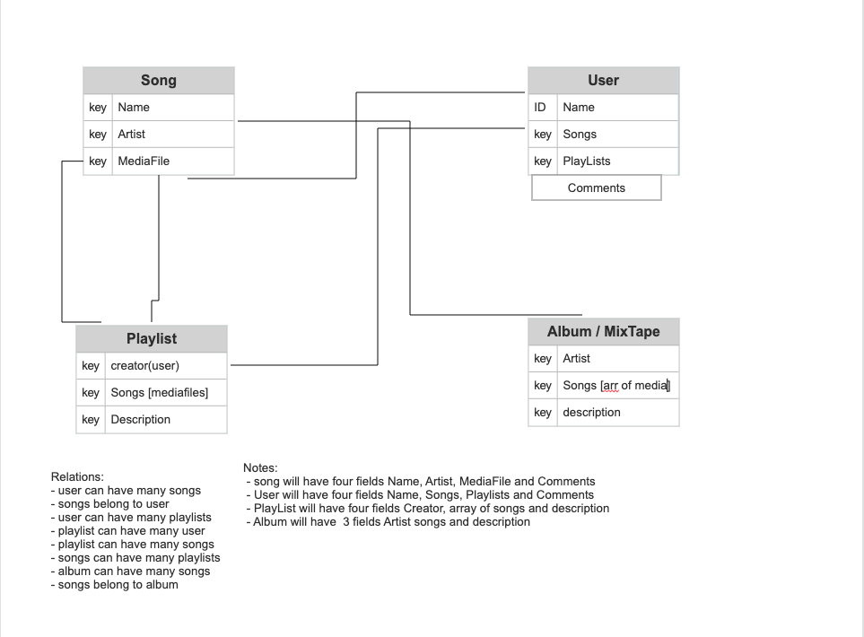

# CloudSound
## a shameless sound cloud copy for sharing songs and listening to them, user's can upload their music, make playlists and share them as well as make "mixtapes" (pretty much just an album)

------------------

# ERD
 
 

 ----------------

 # Technologies used 
 ## (Back-End) Django takes care of the relations while AWS S3 takes care of the media files (pretty much is stored there is pulled through an axios call) 
 ## (Front-End) For the audio player I used a npm package called react h5 audio player, I used State to pass the song audio file into the player. 
 # all mentioned technologies will have links in the credit section 